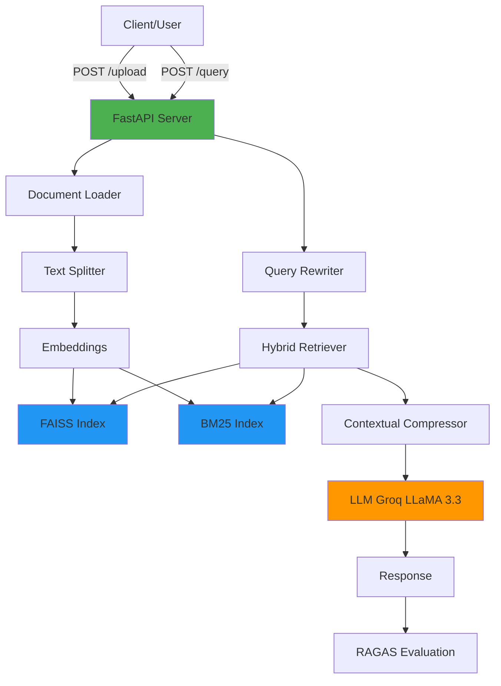

# Production RAG System - Backend

A production-ready **Retrieval-Augmented Generation (RAG)** system built with FastAPI, LangChain, FAISS, and Groq's LLaMA 3.3 70B. This system enables intelligent document querying using hybrid retrieval (FAISS + BM25), query rewriting, contextual compression, and optional RAGAS evaluation.

---

## 🚀 Features

- **Multi-format Document Support**: Upload and process `.pdf`, `.txt`, and `.docx` files
- **Hybrid Retrieval**: Combines dense (FAISS) and sparse (BM25) retrieval for optimal results
- **Query Rewriting**: Automatically rewrites vague or ambiguous queries for better retrieval
- **Contextual Compression**: Uses LLM-based compression to extract only relevant parts of retrieved documents
- **Production-Ready**: Docker support, health checks, CORS configuration, and error handling
- **Scalable Architecture**: Modular design with clear separation of concerns
- **AI-Powered**: Leverages Groq's LLaMA 3.3 70B for high-speed inference
- **Optional Evaluation**: RAGAS metrics integration for answer quality assessment
- **Embeddings**: HuggingFace sentence-transformers for vector representations

---

## 🛠️ Tech Stack

### Backend
- **FastAPI** - Modern, high-performance web framework
- **Uvicorn** - ASGI server
- **Python 3.13** - Latest Python runtime

### AI / ML
- **LangChain** - LLM orchestration framework
- **Groq** - LLaMA 3.3 70B (70 billion parameter model)
- **HuggingFace Sentence Transformers** - `all-MiniLM-L6-v2` embeddings
- **RAGAS** - RAG evaluation framework (optional)

### Vector Database & Search
- **FAISS** - Facebook AI Similarity Search (dense retrieval)
- **BM25** - Best Matching 25 (sparse retrieval)
- **Rank-BM25** - Python BM25 implementation

### Document Processing
- **PyPDF** - PDF parsing
- **python-docx** - Word document processing
- **RecursiveCharacterTextSplitter** - Intelligent text chunking

### DevOps
- **Docker** - Containerization
- **python-dotenv** - Environment variable management

---

## 🏗️ Project Architecture

### System Overview

The system follows a **pipeline-based architecture** for RAG:

```
User Query
    ↓
Query Rewriter (LLM-based clarification)
    ↓
Hybrid Retriever (FAISS + BM25)
    ↓
Contextual Compression (Extract relevant parts)
    ↓
LLM Generation (Groq LLaMA 3.3)
    ↓
Answer + Optional RAGAS Evaluation
```

### Request Flow

1. **Document Upload** (`POST /upload`)
   - User uploads a document
   - Document is loaded based on file type (PDF/TXT/DOCX)
   - Content is split into chunks (1000 chars, 200 overlap)
   - Chunks are embedded and stored in FAISS
   - BM25 index is created and persisted

2. **Query Processing** (`POST /query`)
   - User sends a question
   - Query is rewritten for clarity
   - Hybrid retrieval fetches relevant chunks:
     - FAISS: Dense semantic search
     - BM25: Sparse keyword matching
   - Results are merged and deduplicated
   - Contextual compression extracts relevant excerpts
   - LLM generates answer using retrieved context
   - (Optional) RAGAS evaluates answer quality

---

## 📊 Architecture Diagram



---

## 📁 Folder Structure

```
Backend-rag/
├── main.py                      # FastAPI entry point, CORS, health check
├── Dockerfile                   # Docker containerization config
├── requirements.txt             # Python dependencies
├── README.MD                    # Project documentation (this file)
├── data/                        # Storage for uploaded docs and indexes
│   ├── texttxt.txt             # Sample document
│   ├── faiss_index/            # FAISS vector store
│   │   └── index.faiss         # Persisted FAISS index
│   └── bm25.pkl                # Persisted BM25 retriever
├── app/
│   ├── API/
│   │   └── routes.py           # API endpoints (upload, query, root)
│   ├── chains/
│   │   ├── query_rewriter.py   # Query rewriting chain (LangChain)
│   │   └── rag_chain.py        # Main RAG pipeline chain
│   ├── core/
│   │   ├── config.py           # Environment variables, settings
│   │   ├── embeddings.py       # HuggingFace embeddings
│   │   └── llm.py              # Groq LLM initialization
│   ├── EVALUATION/
│   │   └── ragas_eval.py       # RAGAS metrics for answer evaluation
│   ├── ingestion/
│   │   ├── indexer.py          # FAISS + BM25 indexing logic
│   │   ├── loaders.py          # Document loaders (PDF, TXT, DOCX)
│   │   └── splitter.py         # Text chunking strategy
│   ├── retrieval/
│   │   ├── bm25_retriever.py   # BM25 sparse retriever
│   │   ├── hybrid_retriever.py # FAISS + BM25 hybrid retriever
│   │   ├── reranker.py         # (Empty) Placeholder for reranking
│   │   └── retriever.py        # FAISS retriever with compression
│   └── UTILS/                  # (Empty) Utility functions placeholder
└── __pycache__/                # Python cache (ignore)
```

### Key Files Explained

| File | Purpose |
|------|---------|
| `main.py` | FastAPI application, CORS, health endpoint |
| `routes.py` | API routes: `/`, `/upload`, `/query` |
| `rag_chain.py` | Orchestrates query rewriting → retrieval → LLM generation |
| `query_rewriter.py` | LLM-based query clarification before retrieval |
| `hybrid_retriever.py` | Merges FAISS and BM25 results, deduplicates |
| `retriever.py` | FAISS retriever with contextual compression |
| `bm25_retriever.py` | BM25 implementation with save/load functionality |
| `indexer.py` | Creates/updates FAISS and BM25 indexes |
| `loaders.py` | Loads PDF, TXT, DOCX documents |
| `splitter.py` | Splits documents into chunks (1000 chars, 200 overlap) |
| `llm.py` | Initializes Groq LLaMA 3.3 70B model |
| `embeddings.py` | HuggingFace `all-MiniLM-L6-v2` embeddings |
| `config.py` | Loads environment variables (GROQ_API_KEY) |
| `ragas_eval.py` | Evaluates answers using faithfulness, relevancy, context precision/recall |

---

## 🔌 API Routes / Endpoints

### 1. Health Check
```http
GET /health
```
**Response:**
```json
{
  "status": "ok"
}
```

---

### 2. Root / Welcome
```http
GET /
```
**Response:**
```json
{
  "message": "Welcome to the RAG API"
}
```

---

### 3. Upload Document
```http
POST /upload
Content-Type: multipart/form-data
```

**Request Body:**
- `file`: File upload (PDF, TXT, or DOCX)

**Example (cURL):**
```bash
curl -X POST http://localhost:8000/upload \
  -F "file=@document.pdf"
```

**Response:**
```json
{
  "status": "Document indexed successfully"
}
```

**What Happens:**
1. File is saved to `data/{filename}`
2. Document is loaded and split into chunks
3. Chunks are embedded and added to FAISS index
4. BM25 index is updated and persisted

---

### 4. Query RAG System
```http
POST /query
Content-Type: application/json
```

**Request Body:**
```json
{
  "question": "What is the main topic of the document?"
}
```

**Example (cURL):**
```bash
curl -X POST http://localhost:8000/query \
  -H "Content-Type: application/json" \
  -d '{"question": "What is RAG?"}'
```

**Response:**
```json
{
  "answer": "RAG stands for Retrieval-Augmented Generation, a technique that combines document retrieval with large language model generation to provide accurate, context-aware answers."
}
```

**Error Response (400):**
```json
{
  "detail": "FAISS index not found. Upload documents before querying."
}
```

---

## 🔐 Environment Variables

Create a `.env` file in the root directory:

```env
# Required: Groq API Key for LLaMA 3.3 70B
GROQ_API_KEY=gsk_xxxxxxxxxxxxxxxxxxxxxxxxxxxxx

# Optional: OpenAI API Key (if switching to OpenAI)
# OPENAI_API_KEY=sk-xxxxxxxxxxxxxxxxxxxxxxxxxxxxx
```

### Variable Explanations

| Variable | Required | Description |
|----------|----------|-------------|
| `GROQ_API_KEY` | ✅ Yes | API key from [console.groq.com](https://console.groq.com) for LLaMA access |
| `OPENAI_API_KEY` | ❌ No | Alternative: Use OpenAI models (gpt-4o-mini) |

### Security Notes
- **Never commit `.env` to Git** (add to `.gitignore`)
- For production: Use Docker secrets, AWS Secrets Manager, or Kubernetes ConfigMaps
- Rotate API keys regularly

---

## ⚙️ Setup & Installation

### Prerequisites
- **Python 3.13+** (or Python 3.10+)
- **pip** (Python package manager)
- **Git**
- **Groq API Key** ([Get one here](https://console.groq.com))

### Local Setup (Without Docker)

1. **Clone the Repository**
```bash
git clone <your-repo-url>
cd Backend-rag
```

2. **Create Virtual Environment**
```bash
python3 -m venv .venv
source .venv/bin/activate  # On Windows: .venv\Scripts\activate
```

3. **Install Dependencies**
```bash
pip install --upgrade pip
pip install -r requirements.txt
```

4. **Set Environment Variables**
```bash
# Create .env file
echo "GROQ_API_KEY=your_api_key_here" > .env
```

5. **Verify Setup**
```bash
python -c "from app.core.config import GROQ_API_KEY; print('✅ Config loaded')"
```

---

## 🚀 Running the Application

### Development Mode (Local)

**Option 1: Using Python**
```bash
python main.py
```

**Option 2: Using Uvicorn Directly**
```bash
uvicorn main:app --reload --host 0.0.0.0 --port 8000
```

Server starts at: **http://localhost:8000**

- **Auto-reload**: File changes trigger automatic restart
- **Interactive Docs**: http://localhost:8000/docs
- **Health Check**: http://localhost:8000/health

---

### Production Mode (Docker)

**Build Docker Image**
```bash
docker build -t rag-backend .
```

**Run Container**
```bash
docker run -p 8000:8000 \
  -e GROQ_API_KEY=your_api_key_here \
  rag-backend
```

**With Environment File**
```bash
docker run -p 8000:8000 --env-file .env rag-backend
```

---

### Docker Compose (If Available)

```yaml
# docker-compose.yml (example)
version: '3.8'
services:
  rag-backend:
    build: .
    ports:
      - "8000:8000"
    env_file:
      - .env
    volumes:
      - ./data:/app/data
```

**Run with Compose**
```bash
docker-compose up --build
```

---

## 🔄 Data Flow / Working Explanation

### Scenario: User Uploads a Document and Asks a Question

#### Phase 1: Document Ingestion
```
1. User uploads "research_paper.pdf" via POST /upload
2. System saves file to data/research_paper.pdf
3. PyPDFLoader extracts all text
4. RecursiveCharacterTextSplitter breaks text into chunks:
   - Chunk size: 1000 characters
   - Overlap: 200 characters (preserves context across chunks)
5. HuggingFace embeddings (all-MiniLM-L6-v2) converts chunks to 384-dim vectors
6. FAISS index stores vectors for semantic search
7. BM25 index stores tokenized chunks for keyword search
8. Indexes persisted to disk (data/faiss_index/, data/bm25.pkl)
```

#### Phase 2: Query Processing
```
1. User sends: "What is the main finding?"
   
2. Query Rewriter (LLM):
   - Rewrites to: "What is the main conclusion or key finding of the research paper?"
   
3. Hybrid Retriever:
   a. FAISS Retriever:
      - Converts rewritten query to vector
      - Finds top 5 semantically similar chunks
   b. BM25 Retriever:
      - Tokenizes query
      - Scores chunks by keyword relevance
      - Returns top 5 chunks
   c. Merge & Deduplicate:
      - Combines both result sets
      - Removes duplicates by content
      - Returns top 5 unique chunks
      
4. Contextual Compression:
   - LLM extracts only relevant sentences from each chunk
   - Reduces noise, improves context quality
   
5. LLM Generation:
   - Groq LLaMA 3.3 70B receives:
     - Original question
     - Compressed context
   - Generates answer using only provided context
   
6. Response:
   - Returns JSON: {"answer": "..."}
   
7. Optional RAGAS Evaluation:
   - Measures faithfulness (answer matches context)
   - Answer relevancy (answer addresses question)
   - Context precision/recall (retrieval quality)
```

---

## 🛡️ Error Handling & Edge Cases

### Error Handling Strategy

1. **Missing FAISS Index**
   - **Error**: `RuntimeError` if index doesn't exist
   - **Solution**: Upload documents first
   - **HTTP Status**: `400 Bad Request`

2. **Unsupported File Format**
   - **Error**: `ValueError` for non-PDF/TXT/DOCX files
   - **Solution**: Convert file or use supported formats
   - **HTTP Status**: `400 Bad Request`

3. **Missing API Key**
   - **Error**: `ValueError` at startup
   - **Solution**: Set `GROQ_API_KEY` in `.env`
   - **HTTP Status**: Server fails to start

4. **Empty Documents**
   - **Handled**: Splitter returns empty list, graceful skip

5. **Query Timeout**
   - **Mitigation**: Groq has high-speed inference (~300 tokens/sec)
   - **Future**: Add timeout configuration

### Validation
- File uploads validated by FastAPI `UploadFile`
- Environment variables validated at startup (config.py)
- Document format checked before loading

### Fail-Safe Mechanisms
- FAISS deserialization allows dangerous operations (safe in controlled env)
- BM25 index stored as pickle (ensure trusted sources only)
- CORS restricted to `localhost:3000` (configurable)

---

## 📊 Logging & Monitoring

### Current Logging
- **Uvicorn**: Logs all HTTP requests (INFO level)
- **FastAPI**: Automatic request/response logging
- **Console Output**: Displayed during development

### What is Logged
- Request method, path, status code
- Response time
- Errors with stack traces

### Future Enhancements
- Structured logging (JSON format)
- Log aggregation (ELK, Datadog, CloudWatch)
- Performance metrics (latency, token usage)
- Error tracking (Sentry)

---

## 🔒 Security Considerations

### API Key Handling
- ✅ API keys loaded from `.env` (not hardcoded)
- ✅ `.env` excluded from Git (add to `.gitignore`)
- ⚠️ Docker: Use secrets, not `--env` in production
- 🔄 Rotate keys regularly

### CORS Configuration
```python
allow_origins=["http://localhost:3000"]  # Frontend
```
- **Development**: Allows Next.js frontend
- **Production**: Update to actual domain (e.g., `https://yourapp.com`)

### Authentication
- ❌ **Not Implemented**: No user auth currently
- **Recommendation**: Add JWT tokens, API keys, or OAuth2

### Rate Limiting
- ❌ **Not Implemented**: No rate limiting
- **Recommendation**: Use `slowapi` or nginx rate limiting

### Input Validation
- ✅ FastAPI validates file uploads
- ✅ Query parameters type-checked
- ⚠️ Add max file size limits (e.g., 10MB)

### Deserialization
- ⚠️ FAISS uses `allow_dangerous_deserialization=True`
- **Risk**: Only safe with trusted indexes
- **Mitigation**: Validate index sources

---

## 🚦 Future Improvements / Roadmap

### Short-Term (1-3 months)
- [ ] **Reranker Implementation**: Add cross-encoder reranking (reranker.py)
- [ ] **Authentication**: JWT-based user auth
- [ ] **Rate Limiting**: Prevent abuse
- [ ] **Max File Size**: Enforce upload limits
- [ ] **Logging**: Structured JSON logs
- [ ] **RAGAS Integration**: Enable evaluation in /query response

### Mid-Term (3-6 months)
- [ ] **Caching**: Redis cache for frequent queries
- [ ] **Async Processing**: Background document processing
- [ ] **Multi-User Support**: User-specific indexes
- [ ] **Advanced Chunking**: Semantic chunking, overlap optimization
- [ ] **Monitoring**: Prometheus + Grafana dashboards
- [ ] **WebSockets**: Real-time streaming answers

### Long-Term (6-12 months)
- [ ] **Multi-Modal RAG**: Support images, tables in PDFs
- [ ] **Knowledge Graph**: Add graph-based retrieval
- [ ] **Fine-Tuning**: Custom embeddings for domain
- [ ] **Kubernetes**: Orchestration for scale
- [ ] **Multi-Tenancy**: Isolated environments per tenant
- [ ] **A/B Testing**: Compare retrieval strategies

### Scalability
- **Current**: Single-instance deployment
- **Next**: Horizontal scaling with load balancer
- **Future**: Distributed FAISS, vector database (Pinecone, Weaviate)

---

## 🤝 Contribution Guidelines

### How to Contribute
1. Fork the repository
2. Create a feature branch (`git checkout -b feature/amazing-feature`)
3. Commit changes (`git commit -m 'Add amazing feature'`)
4. Push to branch (`git push origin feature/amazing-feature`)
5. Open a Pull Request

### Code Style
- **Python**: Follow PEP 8 (use `black` formatter)
- **Type Hints**: Encouraged for new code
- **Docstrings**: Use Google-style docstrings
- **Imports**: Sort with `isort`

### Testing (Future)
- Write unit tests for new features
- Ensure existing tests pass
- Aim for >80% code coverage

---

## 📄 License

This project is unlicensed. No license information provided.

**Recommendation**: Add MIT, Apache 2.0, or other open-source license.

---

## 📧 Contact & Support

For questions, issues, or feature requests:
- Open a GitHub issue
- Contact the development team

---

## 🎯 Quick Start Summary

```bash
# 1. Clone and navigate
git clone <repo> && cd Backend-rag

# 2. Setup environment
python3 -m venv .venv && source .venv/bin/activate
pip install -r requirements.txt

# 3. Configure API key
echo "GROQ_API_KEY=your_key" > .env

# 4. Run server
uvicorn main:app --reload

# 5. Upload document
curl -X POST http://localhost:8000/upload -F "file=@doc.pdf"

# 6. Query
curl -X POST http://localhost:8000/query \
  -H "Content-Type: application/json" \
  -d '{"question": "What is this about?"}'
```

---

**Built with ❤️ using FastAPI, LangChain, and Groq LLaMA 3.3**
